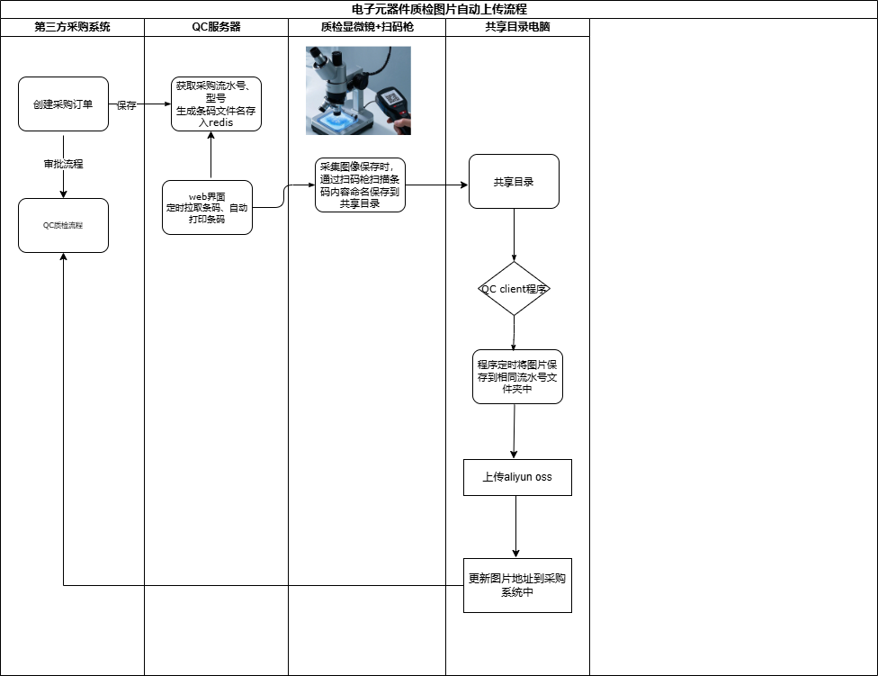

# qc-pic-upload
Automatically upload quality inspection process when microscope generates images
## Demand background: 
A batch of electronic components orders are purchased. The approval process requires microscope quality inspection to generate five images: clue, side view, top mark, bottom mark, xRAY, etc., and automatically submit them to the approval process.
## Flow diagram

